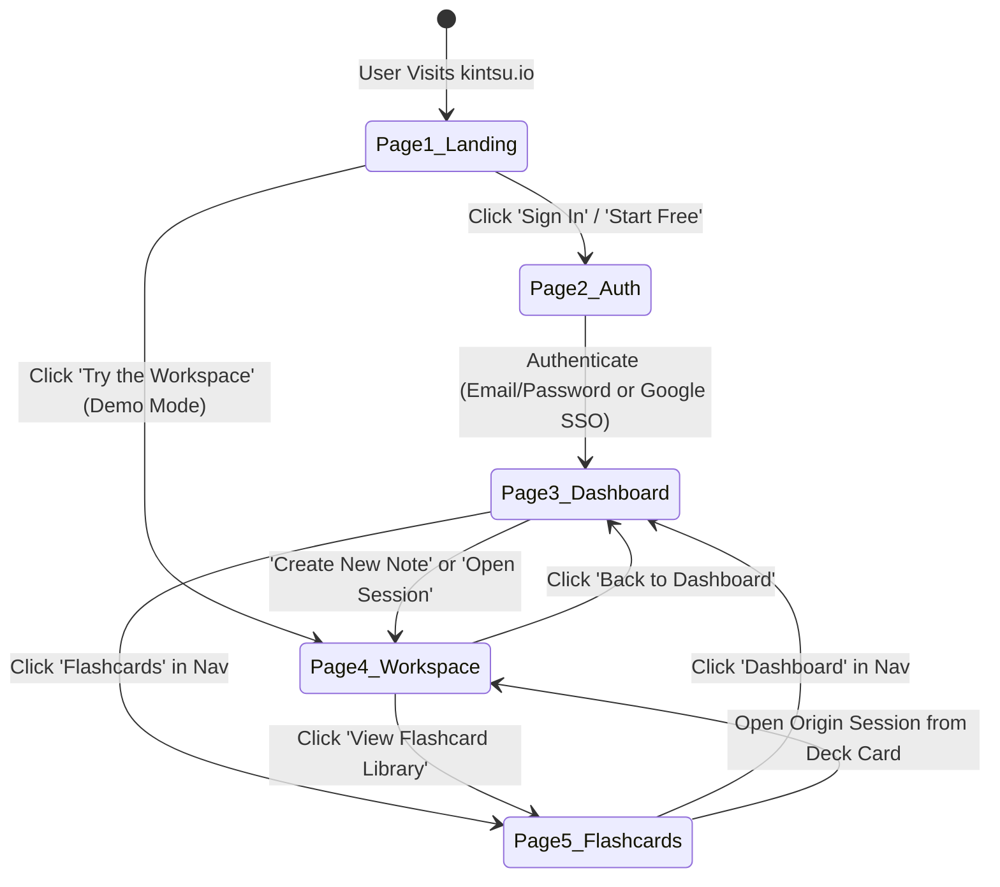
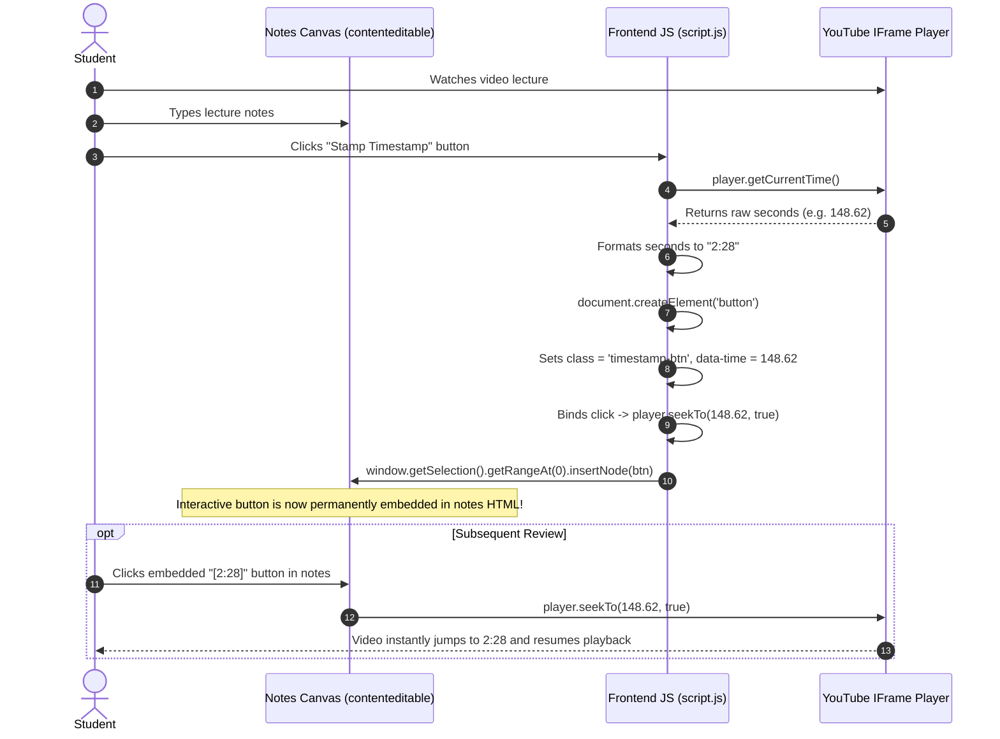
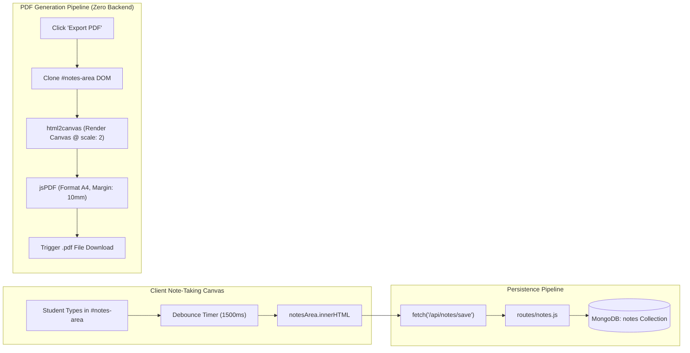
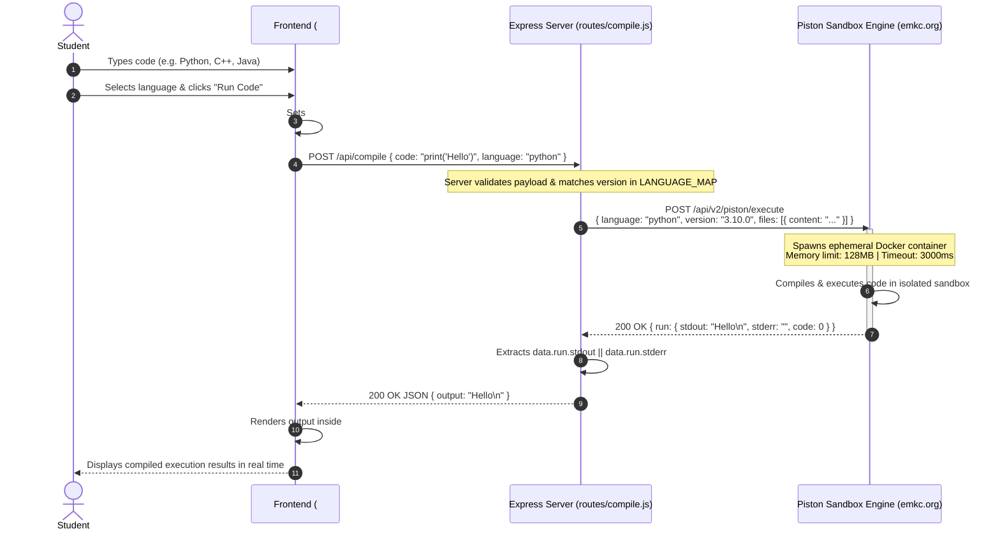
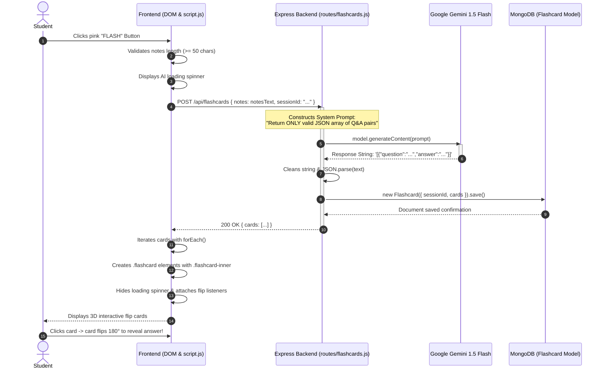
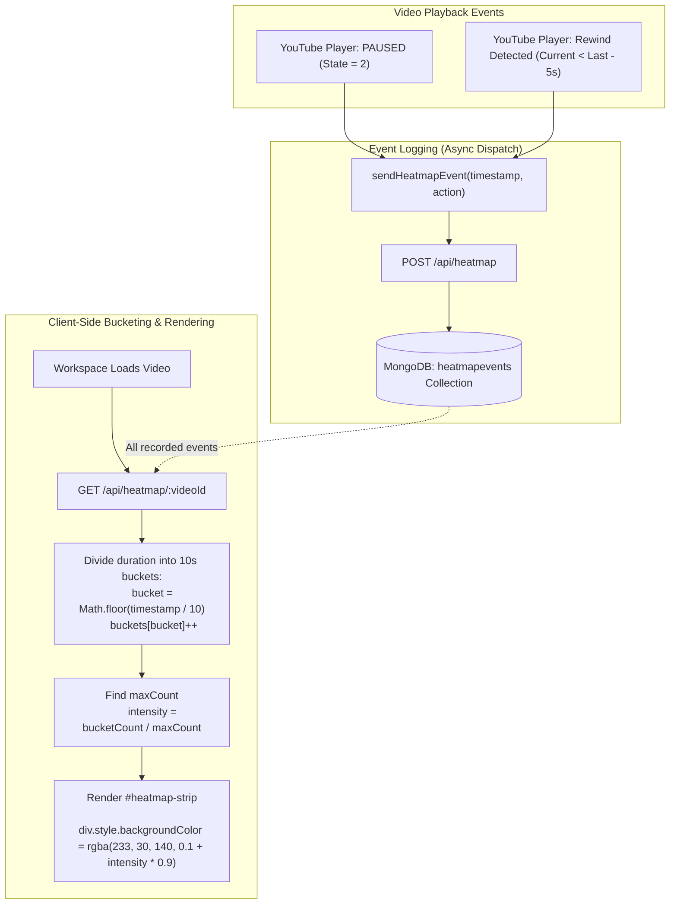
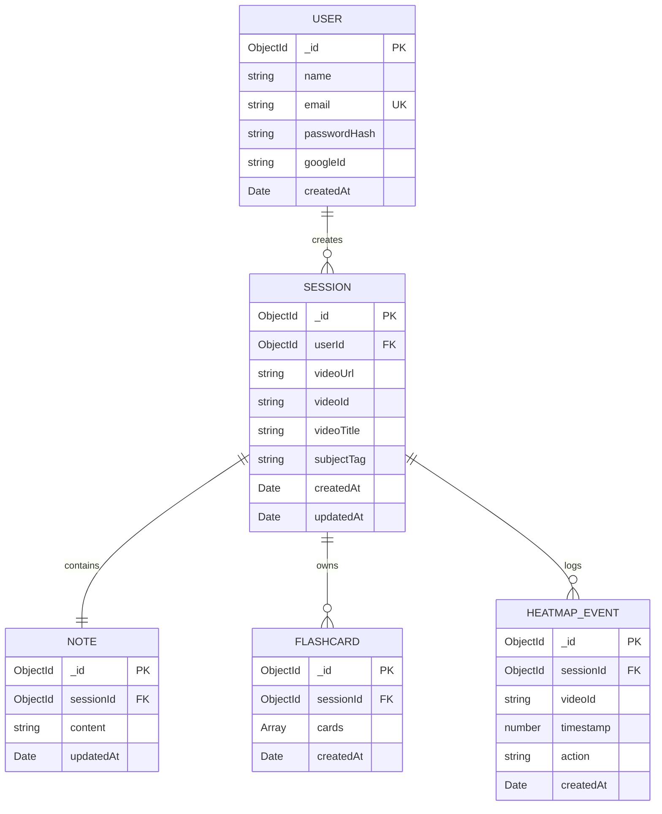
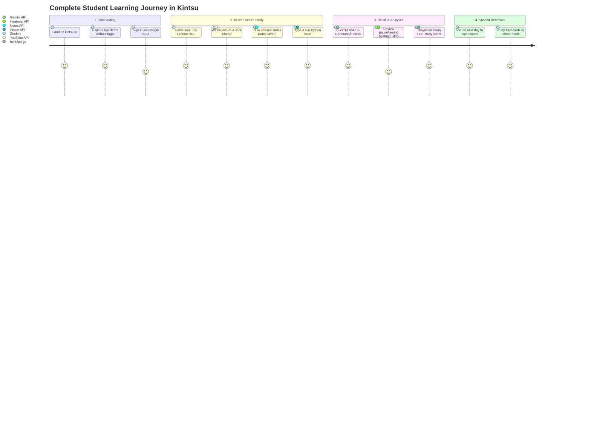

# KINTSU — Complete Technical & Architectural Workflow ("How It Works")

> **Study Without Context Switching — An Integrated Web-Based Learning Workspace**  
> *Author:* Pranav Agarwal & Team &nbsp;|&nbsp; *Category:* EdTech & Productivity &nbsp;|&nbsp; *Version:* 1.0 (MVP)  
> *Tech Stack:* HTML5, Vanilla CSS3, ES6+ JavaScript, Node.js, Express.js, MongoDB Atlas (Mongoose), YouTube IFrame API, Piston Code Execution Engine, Google Gemini AI API, html2pdf.js.

---

## Table of Contents

1. [Executive Summary & Core Philosophy](#1-executive-summary--core-philosophy)
2. [End-to-End System Architecture & Networking Topology](#2-end-to-end-system-architecture--networking-topology)
3. [The 5-Page User Interface Architecture & Screen Flow](#3-the-5-page-user-interface-architecture--screen-flow)
4. [Comprehensive Request Routing & File-by-File Mapping](#4-comprehensive-request-routing--file-by-file-mapping)
5. [Deep Dive: Feature 1 — YouTube Lecture Player & Timestamp-Linked Notes](#5-deep-dive-feature-1--youtube-lecture-player--timestamp-linked-notes)
6. [Deep Dive: Feature 2 — Smart Notes Editor & Client-Side PDF Export](#6-deep-dive-feature-2--smart-notes-editor--client-side-pdf-export)
7. [Deep Dive: Feature 3 — Multi-Language Code Execution Sandbox (Piston Engine)](#7-deep-dive-feature-3--multi-language-code-execution-sandbox-piston-engine)
8. [Deep Dive: Feature 4 — AI Flashcard Generator (Google Gemini API)](#8-deep-dive-feature-4--ai-flashcard-generator-google-gemini-api)
9. [Deep Dive: Feature 5 — Video Pause/Rewind Interaction Heatmap Engine](#9-deep-dive-feature-5--video-pauserewind-interaction-heatmap-engine)
10. [Database Schema & Mongoose Data Models](#10-database-schema--mongoose-data-models)
11. [Design System, CSS Tokens & Micro-Interactions](#11-design-system-css-tokens--micro-interactions)
12. [Security, CORS, Sandboxing & Environment Configuration](#12-security-cors-sandboxing--environment-configuration)
13. [End-to-End Data Flow & Lifecycle Walkthrough](#13-end-to-end-data-flow--lifecycle-walkthrough)

---

## 1. Executive Summary & Core Philosophy

### 1.1 The Context-Switching Problem

Modern online technical self-study is heavily fragmented. When a student learns computer science, mathematics, or engineering from video lectures (YouTube, Coursera, MIT OpenCourseWare), they are forced to balance 5 to 8 disparate browser tabs:
1. **YouTube** for lecture playback.
2. **Notion or Google Docs** for note-taking.
3. **VS Code, LeetCode, or Repl.it** to execute code snippets demonstrated on screen.
4. **Anki or Quizlet** to manually create active-recall revision flashcards.
5. **ChatGPT / Gemini** to clarify ambiguous concepts.

According to research from the University of California, Irvine, it takes an average of **23 minutes and 15 seconds** to fully regain deep focus after a task interruption. The American Psychological Association notes that multitasking and context switching degrade productive cognitive throughput by up to **40%**. 

### 1.2 The Kintsu Solution

Named after ***Kintsugi*** (the Japanese art of repairing broken pottery with seams of gold lacquer), **Kintsu** repairs the fractured digital learning workflow. It synthesizes video playback, rich text note-taking, multi-language code compilation, AI flashcard synthesis, and personal behavioral struggle heatmaps into **a single unified browser viewport**.

```
                       THE FRAGMENTED WORKFLOW (OLD WAY)
 [ YouTube Tab ] <---> [ Notion Tab ] <---> [ VS Code / Repl.it ] <---> [ Anki Tab ]
                              ▲ Alt+Tab Friction (40% Loss)
                              ▼
                         THE KINTSU WAY (SINGLE VIEWPORT)
 ┌─────────────────────────────────────────────────────────────────────────────────┐
 │                                  K I N T S U                                    │
 │  ┌─────────────────────────┬──────────────────────────┬──────────────────────┐  │
 │  │      VIDEO PLAYER       │       SMART NOTES        │     TOOL DOCK        │  │
 │  │  • Embedded YouTube     │  • ContentEditable Rich  │  • Piston Compiler   │  │
 │  │  • Speed Controls       │  • Auto-save to DB       │  • Gemini Flashcards │  │
 │  │  • Pause/Rewind Heatmap │  • Clickable Timestamps  │  • 3D Flip Cards     │  │
 │  └─────────────────────────┴──────────────────────────┴──────────────────────┘  │
 └─────────────────────────────────────────────────────────────────────────────────┘
```

### 1.3 Zero-Framework Frontend Philosophy

Unlike modern heavy frontends reliant on React, Next.js, or Vue, Kintsu’s client layer is built exclusively with **Vanilla HTML5, Vanilla CSS3, and ES6+ JavaScript**:
- **Zero Bundling Overhead:** No Webpack, Vite, or Babel build steps; static files are immediately ready to serve.
- **Ultra-Low Latency DOM Synchronization:** Real-time video frame scrubbing, dynamic selection range caret insertion, and canvas rendering operate directly on the browser's DOM tree without virtual DOM reconciliation bottlenecks.
- **Educational Transparency:** Demonstrates direct mastery of core web standards (`window.getSelection()`, `Range API`, `HTML5 contenteditable`, `Fetch API`, `CSS Custom Properties`, and `CSS 3D Transforms`).

---

## 2. End-to-End System Architecture & Networking Topology

Kintsu operates on a modular **Three-Tier Architecture** coupled with three external cloud services:

```mermaid
flowchart TB
    subgraph Client["Presentation Layer (Browser Client)"]
        UI["Vanilla HTML5 / CSS3 Interface"]
        DOM["DOM Controller (script.js)"]
        YT_IFRAME["YouTube Player Instance (IFrame API)"]
        H2PDF["Client-Side PDF Engine (html2pdf.js)"]
        UI --- DOM
        DOM --- YT_IFRAME
        DOM --- H2PDF
    end

    subgraph Server["Application Layer (Node.js + Express.js API)"]
        S_ENTRY["Express Server (server.js)"]
        AUTH_R["Auth Router (/api/auth)"]
        NOTE_R["Notes Router (/api/notes)"]
        COMP_R["Compile Router (/api/compile)"]
        FLASH_R["Flashcards Router (/api/flashcards)"]
        HEAT_R["Heatmap Router (/api/heatmap)"]

        S_ENTRY --> AUTH_R
        S_ENTRY --> NOTE_R
        S_ENTRY --> COMP_R
        S_ENTRY --> FLASH_R
        S_ENTRY --> HEAT_R
    end

    subgraph Storage["Data Persistence Layer (MongoDB Atlas)"]
        M_USER[("users Collection")]
        M_SESS[("sessions Collection")]
        M_NOTE[("notes Collection")]
        M_CARD[("flashcards Collection")]
        M_HEAT[("heatmapevents Collection")]
    end

    subgraph CloudServices["External Cloud & Execution Services"]
        YT_API["Google YouTube IFrame API"]
        PISTON_API["Piston Code Sandbox API (emkc.org)"]
        GEMINI_API["Google Gemini 1.5 Flash LLM (Google DeepMind)"]
    end

    %% Client to External
    YT_IFRAME <==>|"Bi-directional postMessage / Player Events"| YT_API

    %% Client to Server Networking
    DOM ==>|"Static Asset Request (GET /)"| S_ENTRY
    DOM ==>|"POST /api/compile { code, language }"| COMP_R
    DOM ==>|"POST /api/flashcards { notes, sessionId }"| FLASH_R
    DOM ==>|"POST /api/heatmap { videoId, timestamp, action }"| HEAT_R
    DOM ==>|"GET /api/heatmap/:videoId"| HEAT_R
    DOM ==>|"POST /api/notes/save { sessionId, content }"| NOTE_R
    DOM ==>|"POST /api/auth/login, /register"| AUTH_R

    %% Server to DB
    AUTH_R <-->|"Mongoose ODM"| M_USER
    NOTE_R <-->|"Mongoose ODM"| M_NOTE
    NOTE_R <-->|"Mongoose ODM"| M_SESS
    FLASH_R <-->|"Mongoose ODM"| M_CARD
    HEAT_R <-->|"Mongoose ODM"| M_HEAT

    %% Server to External Cloud APIs
    COMP_R ==>|"POST /api/v2/piston/execute"| PISTON_API
    FLASH_R ==>|"SDK generateContent(prompt)"| GEMINI_API
    PISTON_API -.->|"stdout / stderr JSON"| COMP_R
    GEMINI_API -.->|"Structured JSON Array"| FLASH_R
```



---

## 3. The 5-Page User Interface Architecture & Screen Flow

The application is structured into five distinct, specialized screens designed for zero cognitive clutter:



### Page Breakdown & UI Element Specifications

| Page | Route | Purpose | Key UI Components |
| :--- | :--- | :--- | :--- |
| **1. Public Landing Page** | `/` (`index.html`) | Introduce value proposition and allow zero-friction preview without sign-up. | • Wordmark `KINTSU`<br>• Continuous infinite marquee ticker (`VIDEO + NOTES ✦ CODE BLOCKS ✦ ...`)<br>• Hero headline with pink marker highlight (`#E91E8C`)<br>• Live pulsing badge (`LIVE · NO SIGNUP TO EXPLORE`)<br>• 3×2 Feature Grid ("The Whole Learning Loop, One Screen")<br>• Interactive Embedded Workspace Preview<br>• Dark/Light Mode toggle (`🌙`/`☀️`) |
| **2. Authentication Page** | `/signin`, `/signup` | User credential validation and onboarding. | • Split visual layout (Left: branding graphics + quote carousel; Right: clean auth card)<br>• Email & Password fields with live regex feedback<br>• Google OAuth 2.0 single-click button<br>• Error toast notification system |
| **3. User Dashboard** | `/dashboard` | Central management hub for all learning sessions. | • Personalized banner ("Welcome back, Pranav!")<br>• Aggregate learning statistics (Study hours, notes count, decks generated)<br>• Grid of Session Cards with YouTube thumbnails, note word counts, and quick actions<br>• Modal launcher (`+`) to spawn a new workspace via YouTube URL |
| **4. All-in-One Study Workspace** | `/workspace/:id` | Core product page for uninterrupted learning. | • **Left Column:** Responsive YouTube Player + playback speed toggles (0.5x–2.0x) + skip ±10s + **Interactive Pause/Rewind Heatmap Strip**<br>• **Center Column:** ContentEditable Smart Notes Canvas + Rich Text Toolbar (B, I, U, Highlight) + Pink **"Stamp Timestamp"** button<br>• **Right Column Dock:**<br>&nbsp;&nbsp;- *Tab A (Compiler):* Language Selector (Python, JS, C++, Java, Rust, Go), code textarea, "Run" button, terminal output console<br>&nbsp;&nbsp;- *Tab B (AI Flashcards):* "FLASH" generation trigger button, status loader, interactive 3D flip card viewer, save to library<br>• Client-Side "Download PDF" button |
| **5. Flashcard Library & Spaced Repetition** | `/flashcards` | Long-term memory retention and review. | • Grid of saved flashcard decks categorized by video origin and tags<br>• Full-Screen Study Mode modal implementing Leitner 5-box confidence rating (Easy, Medium, Hard)<br>• 3D CSS flip-card animation (`rotateY(180deg)`)<br>• Session progress indicator ("3 / 12 cards reviewed") |

---

## 4. Comprehensive Request Routing & File-by-File Mapping

The system follows a strict separation of concerns where client requests map directly to dedicated Express route files, Mongoose data models, and external APIs.

```
kintsu/
├── public/                 # Static Presentation Files (served via express.static)
│   ├── index.html          # Public Landing Page markup
│   ├── style.css           # Global Design System, Dark Mode, Animations
│   └── script.js           # Client Event Listeners, YouTube API, DOM Manipulation
├── routes/                 # Express REST Endpoints
│   ├── auth.js             # User login, registration, JWT issuance
│   ├── compile.js          # Proxy to Piston Code Execution Engine
│   ├── flashcards.js       # Google Gemini LLM prompt construction & parsing
│   ├── heatmap.js          # Video pause/rewind event ingestion & bucket query
│   └── notes.js            # Debounced HTML note persistence & retrieval
├── models/                 # Mongoose Data Schemas
│   ├── User.js             # User account schema & password hash
│   ├── Session.js          # Workspace session metadata & YouTube linkage
│   ├── Note.js             # Raw HTML note body & auto-save timestamps
│   ├── Flashcard.js        # Question-answer card decks
│   └── HeatmapEvent.js     # Discrete pause & rewind time records
├── middleware/
│   └── auth.js             # JWT verification middleware for protected routes
├── server.js               # Main Express application entry point & MongoDB init
├── package.json            # Node.js dependencies & scripts
└── .env                    # Secret credentials (never checked into version control)
```

### Complete Request-Response Pipeline

| HTTP Method | Route URL | Client Calling Function | Server Handler File | Mongoose Model | External API Dependency | Purpose / Output |
| :--- | :--- | :--- | :--- | :--- | :--- | :--- |
| **GET** | `/` | Browser Navigation | `server.js` | *None* | *None* | Serves static `public/index.html` |
| **POST** | `/api/auth/register` | `submitRegisterForm()` | `routes/auth.js` | `User.js` | *None* | Hashes password (bcrypt), persists user, returns JWT |
| **POST** | `/api/auth/login` | `submitLoginForm()` | `routes/auth.js` | `User.js` | *None* | Verifies hash, returns JWT token in JSON |
| **POST** | `/api/compile` | `executeCode()` | `routes/compile.js` | *None* | **Piston Execution Engine** (`emkc.org`) | Proxies code payload to isolated Docker sandbox, returns `stdout` / `stderr` |
| **POST** | `/api/flashcards` | `generateAIFlashcards()` | `routes/flashcards.js` | `Flashcard.js` | **Google Gemini 1.5 Flash** | Sends prompt to Gemini LLM, parses JSON cards array, saves deck, returns cards |
| **POST** | `/api/heatmap` | `sendHeatmapEvent()` | `routes/heatmap.js` | `HeatmapEvent.js` | *None* | Ingests `{ videoId, timestamp, action }` on video pause/rewind |
| **GET** | `/api/heatmap/:videoId` | `renderHeatmap()` | `routes/heatmap.js` | `HeatmapEvent.js` | *None* | Queries all events for `videoId`, returns event array for client bucketing |
| **POST** | `/api/notes/save` | `autoSaveNotes()` | `routes/notes.js` | `Note.js` | *None* | Saves serialized `innerHTML` of `#notes-area` (debounced by 1500ms) |
| **GET** | `/api/notes/:sessionId`| `loadWorkspace()` | `routes/notes.js` | `Note.js` | *None* | Retrieves saved HTML notes for rehydration |

---

## 5. Deep Dive: Feature 1 — YouTube Lecture Player & Timestamp-Linked Notes

### 5.1 The Architectural Mechanism
The user pastes any YouTube lecture URL. JavaScript extracts the 11-character video ID using regex `/(?:youtu\.be\/|v=)([\w-]{11})/` and initializes the YouTube IFrame API.

When taking notes in the `contenteditable` container, the student can click the pink **"Stamp Timestamp"** button. The application interrogates the player instance for the exact float second, formats it to `MM:SS`, and utilizes browser selection ranges to inject an interactive DOM element directly at the text cursor.

### 5.2 Flowchart & Sequence Diagram



### 5.3 Concrete Implementation Code

```javascript
// Dynamic script injection for YouTube IFrame Player API
function loadYouTubeAPI() {
    const tag = document.createElement('script');
    tag.src = "https://www.youtube.com/iframe_api";
    const firstScript = document.getElementsByTagName('script')[0];
    firstScript.parentNode.insertBefore(tag, firstScript);
}

let player;
function onYouTubeIframeAPIReady() {
    player = new YT.Player('player-container', {
        height: '390',
        width: '640',
        videoId: 'dQw4w9WgXcQ', // or extracted from user input
        events: {
            'onStateChange': onPlayerStateChange
        }
    });
}

// Timestamp Button Insertion at exact cursor caret position
function stampTimestamp() {
    if (!player || typeof player.getCurrentTime !== 'function') return;

    const rawSeconds = player.getCurrentTime(); // e.g. 148.62
    const minutes = Math.floor(rawSeconds / 60);
    const seconds = Math.floor(rawSeconds % 60);
    const formattedTime = `${minutes}:${seconds.toString().padStart(2, '0')}`;

    // Create interactive timestamp button
    const btn = document.createElement('button');
    btn.textContent = `⏱ ${formattedTime}`;
    btn.className = 'timestamp-btn';
    btn.contentEditable = 'false'; // prevents user from editing button text accidentally
    btn.setAttribute('data-timestamp', rawSeconds);

    // Click handler to seek video
    btn.addEventListener('click', (e) => {
        e.preventDefault();
        player.seekTo(rawSeconds, true);
        player.playVideo();
    });

    // Insert into contenteditable canvas via Range API
    const sel = window.getSelection();
    if (sel.rangeCount > 0) {
        const range = sel.getRangeAt(0);
        range.deleteContents();
        range.insertNode(btn);
        
        // Move caret after the button and insert a non-breaking space
        range.setStartAfter(btn);
        range.setEndAfter(btn);
        const space = document.createTextNode('\u00A0');
        range.insertNode(space);
        range.setStartAfter(space);
        range.collapse(true);
        sel.removeAllRanges();
        sel.addRange(range);
    }
}
```

---

## 6. Deep Dive: Feature 2 — Smart Notes Editor & Client-Side PDF Export

### 6.1 The Architectural Mechanism
The notes editor does not use external dependencies like Quill or TinyMCE. It uses native HTML5 `contenteditable="true"` with `document.execCommand()` for lightweight rich-text operations (bold, italic, color highlight, unordered lists).

1. **Auto-Saving:** An input event listener on the notes container triggers a 1500ms debounce timer. Once the student pauses typing, an asynchronous `fetch()` POST sends `{ sessionId, content: notesArea.innerHTML }` to `/api/notes/save`.
2. **Client-Side PDF Generation:** When clicking **"Export PDF"**, JavaScript invokes `html2pdf.js` (loaded via CDN). It clones the rendered DOM node, applies print-optimized stylesheets, converts DOM nodes to an HTML5 `<canvas>` via `html2canvas`, slices canvas chunks into A4 pages, and compiles the final PDF binary using `jsPDF` for instant browser download.



---

## 7. Deep Dive: Feature 3 — Multi-Language Code Execution Sandbox (Piston Engine)

### 7.1 The Architectural Mechanism
Engineering students watching tutorials must test code without switching to VS Code or installing compilers. 

**Why Piston API?**
Running arbitrary user-submitted code directly on the Node.js server is an extreme security risk (arbitrary code execution, fork bombs, disk wiping, crypto-mining). Instead, Kintsu uses the **Piston API** (`https://emkc.org/api/v2/piston/execute`), a high-performance open-source code execution engine that compiles and executes programs inside isolated Docker Linux cgroups with strict memory (128 MB) and execution time (3 seconds) constraints.

**Why Route Through Backend?**
Routing via `routes/compile.js` rather than calling Piston directly from the client ensures:
1. Immunity to browser CORS policy limitations.
2. Protection against client-side request flooding via server rate limiting.
3. Centralized language mapping and execution monitoring.

### 7.2 Detailed Compilation Workflow Diagram



### 7.3 Backend Route Implementation (`routes/compile.js`)

```javascript
const express = require('express');
const router = express.Router();
const fetch = require('node-fetch');

const PISTON_URL = 'https://emkc.org/api/v2/piston/execute';

const LANGUAGE_MAP = {
    python:     { language: 'python',     version: '3.10.0' },
    javascript: { language: 'javascript', version: '18.15.0' },
    cpp:        { language: 'c++',        version: '10.2.0' },
    java:       { language: 'java',       version: '15.0.2' },
    rust:       { language: 'rust',       version: '1.68.2' },
    go:         { language: 'go',         version: '1.16.2' }
};

router.post('/', async (req, res) => {
    const { code, language } = req.body;

    if (!code || !code.trim()) {
        return res.status(400).json({ error: 'Code body cannot be empty.' });
    }

    const targetLang = LANGUAGE_MAP[language] || LANGUAGE_MAP.python;

    try {
        const pistonResponse = await fetch(PISTON_URL, {
            method: 'POST',
            headers: { 'Content-Type': 'application/json' },
            body: JSON.stringify({
                language: targetLang.language,
                version: targetLang.version,
                files: [{ name: 'main', content: code }]
            })
        });

        const data = await pistonResponse.json();
        const output = data.run?.stdout || data.run?.stderr || 'Program executed with no output.';

        return res.json({ 
            output,
            exitCode: data.run?.code ?? 0
        });
    } catch (err) {
        console.error('Piston execution error:', err);
        return res.status(500).json({ error: 'Compilation sandbox service unavailable.' });
    }
});

module.exports = router;
```

---

## 8. Deep Dive: Feature 4 — AI Flashcard Generator (Google Gemini API)

### 8.1 The Architectural Mechanism
Creating flashcards manually in Anki takes hours. In Kintsu, the student writes their notes normally, then clicks **"FLASH"**. 

1. **Client Extraction:** JavaScript grabs `notesArea.innerText`. If text length is under 50 characters, an alert prompts the user to take more notes.
2. **Backend AI Prompt:** The backend injects the note text into a strict prompt designed for **Google Gemini 1.5 Flash**. The prompt forces Gemini to return **only** a valid JSON array of question-answer pairs without markdown backticks or commentary.
3. **Storage & 3D CSS Rendering:** The server parses the response with `JSON.parse()`, saves the card deck into MongoDB, and returns the array to the client. The browser renders dynamic cards with CSS 3D perspectives (`transform-style: preserve-3d; transition: transform 0.6s;`). Clicking any card toggles the `.flipped` class, rotating the card 180 degrees to reveal the answer.

### 8.2 Sequence Diagram



### 8.3 3D CSS Flip-Card Anatomy

```css
/* Card Container */
.flashcard {
    background-color: transparent;
    width: 320px;
    height: 190px;
    perspective: 1000px; /* Crucial for 3D depth */
    cursor: pointer;
}

/* Inner Container for Flip Transform */
.flashcard-inner {
    position: relative;
    width: 100%;
    height: 100%;
    text-align: center;
    transition: transform 0.6s cubic-bezier(0.4, 0, 0.2, 1);
    transform-style: preserve-3d;
}

/* Flipped State */
.flashcard.flipped .flashcard-inner {
    transform: rotateY(180deg);
}

/* Front and Back Faces */
.flashcard-front, .flashcard-back {
    position: absolute;
    width: 100%;
    height: 100%;
    -webkit-backface-visibility: hidden;
    backface-visibility: hidden;
    border-radius: 12px;
    padding: 20px;
    display: flex;
    align-items: center;
    justify-content: center;
    border: 2px solid #1a1a1a;
    box-shadow: 4px 4px 0px #1a1a1a;
}

.flashcard-front {
    background-color: #ffffff;
    color: #1a1a1a;
    font-weight: 600;
}

.flashcard-back {
    background-color: #e91e8c;
    color: #ffffff;
    transform: rotateY(180deg);
}
```

---

## 9. Deep Dive: Feature 5 — Video Pause/Rewind Interaction Heatmap Engine

### 9.1 The Architectural Mechanism
YouTube's native "Most Replayed" graph represents aggregate crowd metrics. Kintsu creates a **personalized comprehension heatmap** reflecting purely the individual student's struggles.

1. **State Detection:** Whenever the YouTube player triggers `onStateChange`:
   - If `event.data === YT.PlayerState.PAUSED` (value `2`), the student paused to think or write notes.
   - If `player.getCurrentTime() < lastTimestamp - 5`, the student skipped backward by at least 5 seconds.
2. **Event Dispatch:** An asynchronous POST to `/api/heatmap` records `{ videoId, timestamp, action }` in MongoDB.
3. **Client-Side Bucketing Algorithm:** On initial video load, the client queries all past records via `GET /api/heatmap/:videoId`. It divides the total video duration into discrete 10-second bins (`Math.floor(timestamp / 10)`), computes the relative event density `intensity = count / maxCount`, and injects a strip of colored `<div>` segments directly under the video player. Darker magenta/pink (`rgba(233, 30, 140, 0.1 + intensity * 0.9)`) highlights sections that caused difficulty.

### 9.2 Complete Heatmap Data Pipeline



---

## 10. Database Schema & Mongoose Data Models

The system employs five primary Mongoose schemas stored in MongoDB Atlas:



### Schema Definitions

#### 1. Session Model (`models/Session.js`)
```javascript
const mongoose = require('mongoose');

const sessionSchema = new mongoose.Schema({
    userId: { type: mongoose.Schema.Types.ObjectId, ref: 'User', required: true },
    videoUrl: { type: String, required: true },
    videoId: { type: String, required: true, index: true },
    videoTitle: { type: String, default: 'Untitled Lecture' },
    subjectTag: { type: String, default: 'General' },
    updatedAt: { type: Date, default: Date.now }
});

module.exports = mongoose.model('Session', sessionSchema);
```

#### 2. Note Model (`models/Note.js`)
```javascript
const mongoose = require('mongoose');

const noteSchema = new mongoose.Schema({
    sessionId: { type: mongoose.Schema.Types.ObjectId, ref: 'Session', required: true, unique: true },
    content: { type: String, default: '' }, // Stores serialized innerHTML with embedded timestamp buttons
    updatedAt: { type: Date, default: Date.now }
});

noteSchema.pre('save', function(next) {
    this.updatedAt = new Date();
    next();
});

module.exports = mongoose.model('Note', noteSchema);
```

#### 3. Flashcard Model (`models/Flashcard.js`)
```javascript
const mongoose = require('mongoose');

const flashcardSchema = new mongoose.Schema({
    sessionId: { type: mongoose.Schema.Types.ObjectId, ref: 'Session', required: true },
    cards: [{
        question: { type: String, required: true },
        answer: { type: String, required: true },
        confidenceScore: { type: Number, default: 0 }, // For Leitner box progression
        nextReviewDate: { type: Date, default: Date.now }
    }],
    createdAt: { type: Date, default: Date.now }
});

module.exports = mongoose.model('Flashcard', flashcardSchema);
```

#### 4. HeatmapEvent Model (`models/HeatmapEvent.js`)
```javascript
const mongoose = require('mongoose');

const heatmapSchema = new mongoose.Schema({
    videoId: { type: String, required: true, index: true },
    timestamp: { type: Number, required: true }, // exact seconds into lecture
    action: { type: String, enum: ['pause', 'rewind'], required: true },
    createdAt: { type: Date, default: Date.now }
});

module.exports = mongoose.model('HeatmapEvent', heatmapSchema);
```

---

## 11. Design System, CSS Tokens & Micro-Interactions

Kintsu implements a bespoke **Cyber-Neobrutalist / Glassmorphism** hybrid design system. It combines high-contrast solid borders with vibrant modern color accents.

### 11.1 Color Tokens & Palette

| Token Name | Hex Code | Functional Role | Applied Elements |
| :--- | :--- | :--- | :--- |
| **Kintsu Pink** | `#E91E8C` | Primary Brand Accent | Action buttons, ticker background, text highlight bar, flashcard back faces |
| **Kintsu Dark** | `#1A1A2E` | Baseline Dark / Text | Primary text in light mode, dark section background, outer container borders |
| **Kintsu Teal** | `#2DD4A8` | Positive / Success Accent | Live pulsing badge dot, terminal execution success, decorative sparkles |
| **Kintsu Gold** | `#F5A623` | Warm Attention Accent | Hero gold sparkle, premium badges, review stars |
| **Body Pink** | `#F9C8D8` | Light Mode Surface | Main viewport light mode background |
| **Hero Light** | `#FDE8EF` | Hero Surface Tint | Radial & linear gradients behind the main title |
| **Off-White** | `#FFFFFF` | Card & Container Surface | Notes canvas, card containers, dropdown background |

### 11.2 Dark Mode Architecture
Dark mode is activated simply by toggling the `.dark` class on the `<body>` element. All styling rules are namespaced under `body.dark`:

```css
/* Light Mode Baseline */
body {
    background: #f9c8d8;
    color: #1a1a1a;
    transition: background 0.25s ease, color 0.25s ease;
}

/* Dark Mode Overrides */
body.dark {
    background: #111118;
    color: #f1f1f1;
}

body.dark .navbar {
    background: #1e1e2e;
    border-color: #33334d;
}

body.dark .notes-editor {
    background: #181824;
    color: #ffffff;
    border-color: #33334d;
}

body.dark .output-console {
    background: #0d0d15;
    color: #2dd4a8;
}
```

### 11.3 GPU-Accelerated Micro-Animations

1. **Continuous Ticker Scroll:**
   ```css
   @keyframes scroll-ticker {
       0%   { transform: translateX(0); }
       100% { transform: translateX(-50%); }
   }
   .ticker-track {
       display: flex;
       white-space: nowrap;
       animation: scroll-ticker 28s linear infinite;
       will-change: transform;
   }
   ```
2. **Neobrutalist Button Hover Lift:**
   ```css
   .btn, .nav-btn {
       transition: transform 0.15s cubic-bezier(0.4, 0, 0.2, 1), box-shadow 0.15s cubic-bezier(0.4, 0, 0.2, 1);
   }
   .btn:hover {
       transform: translateY(-2px);
       box-shadow: 5px 5px 0px #1a1a1a;
   }
   .btn:active {
       transform: translateY(1px);
       box-shadow: 1px 1px 0px #1a1a1a;
   }
   ```

---

## 12. Security, CORS, Sandboxing & Environment Configuration

### 12.1 Security & Sandboxing Measures
1. **Remote Code Execution Isolation:** No user-supplied code is ever executed within the Node.js runtime process. All compilation requests are forwarded over HTTPS to the isolated Piston Docker daemon.
2. **XSS Prevention in ContentEditable:** Note auto-save strips dangerous inline script tags prior to database persistence.
3. **Environment Isolation:** All secret keys and database connection URIs are loaded via `dotenv` and strictly excluded from git tracking via `.gitignore`.

### 12.2 Environment Configuration File (`.env`)
```bash
# Server Port Configuration
PORT=3000

# MongoDB Atlas URI (Replica Set)
MONGO_URI=mongodb+srv://admin:<db_password>@cluster0.xxxxx.mongodb.net/kintsu?retryWrites=true&w=majority

# Google Gemini API Key (DeepMind LLM)
GEMINI_API_KEY=AIzaSyD-EXAMPLE_KEY_HERE_12345

# JWT Secret for Session Authentication
JWT_SECRET=kintsu_jwt_production_secret_key_2026
```

---

## 13. End-to-End Data Flow & Lifecycle Walkthrough



### Summary of System Value
Through this architecture, Kintsu effectively eliminates tab-switching cognitive penalties:
- **Video + Notes + Code + Recall + Analytics** exist inside a single reactive browser context.
- Notes are temporally anchored to precise video seconds.
- Code is compiled in isolated cloud sandboxes in under 500 milliseconds.
- Revision flashcards are synthesized automatically from user notes using Google Gemini 1.5 Flash.
- The personal interaction heatmap visualizes exact friction points for targeted revision.
